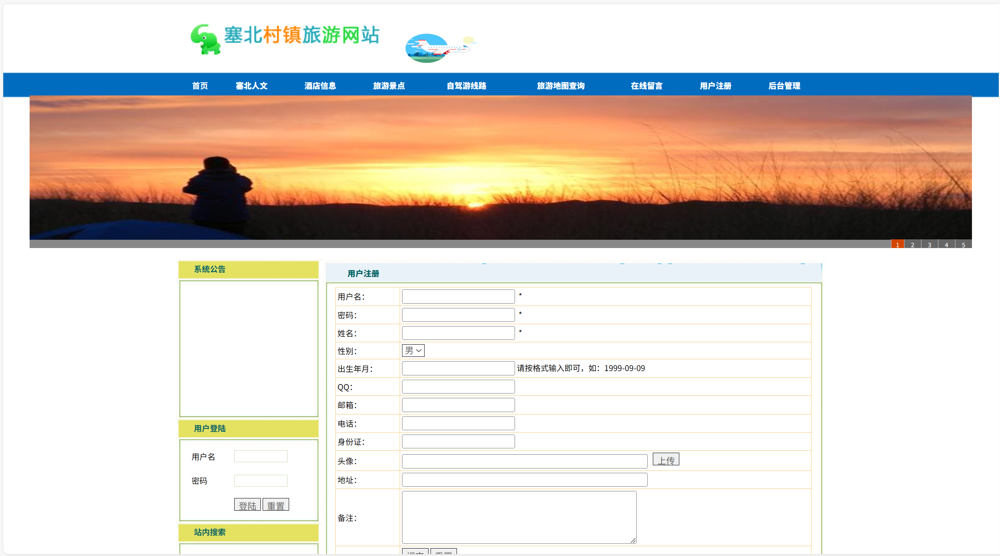

# jspServlet023
jspServlet023旅游网站信息管理系统+BG+PPT
 
## 源码问题查看主页咨询

### 一、关键词

旅游网站信息管理系统，旅游管理系统

### 二、作品包含
源码+数据库+设计报告文档+PPT+全套环境和工具资源+本地部署教程

### 三、项目技术
前端技术：Html、Css、Js、Jquery、Bootstrap
后端技术：Java、JSP、Servlet、JDBC

### 四、运行环境（以下版本亲测，其他版本兼容性请自行测试）
开发工具：IDEA/eclipse

数据库：MySQL5.7或8.0

服务器：Tomcat8.5或Tomcat9.0

数据库管理工具：Navicat10以上版本

环境配置软件： JDK1.8

浏览器：谷歌浏览器

### 五、项目介绍
项目编号：jspServlet023

塞北村镇旅游网站设计与开发以方便、快捷、费用低的优点正慢慢地进入人们的生活。人们从传统的旅游方式转变为在线预览，减轻了劳动者的工作量。使得旅游从业人员有更多时间来获取、了解、掌握信息。

塞北村镇旅游网站的功能比较全面丰富，尽量满足大部分旅游客户的要求，在网站的首页显示了该网站的具体实现模块部分。包含塞北人文、塞北故事、酒店信息 、旅游景点、 自驾游线路 、旅游地图查询、天气预报 、在线评价 、用户注册、 后台管理等功能：后台管理包括：塞北人文、塞北故事、酒店信息、旅游景点、自驾游线路、酒店预订，在线留言、用户增加删除修改、系统等的管理。

### 六、运行截图

